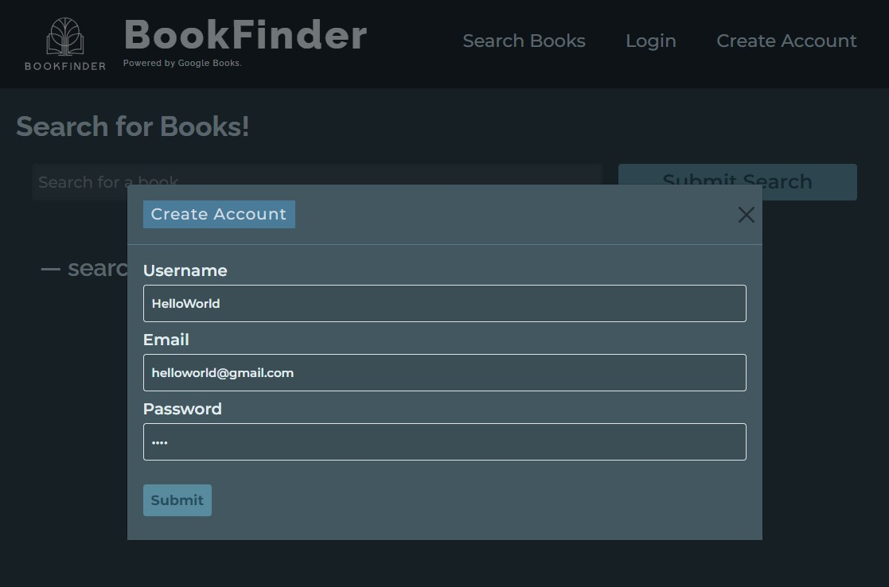
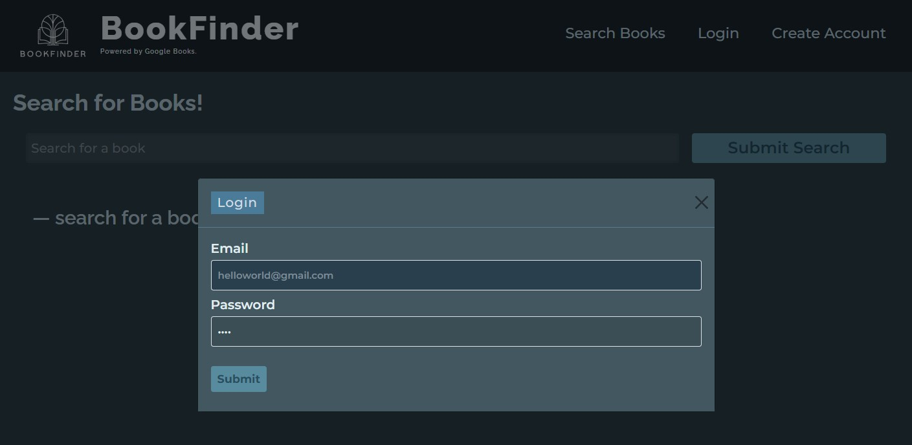
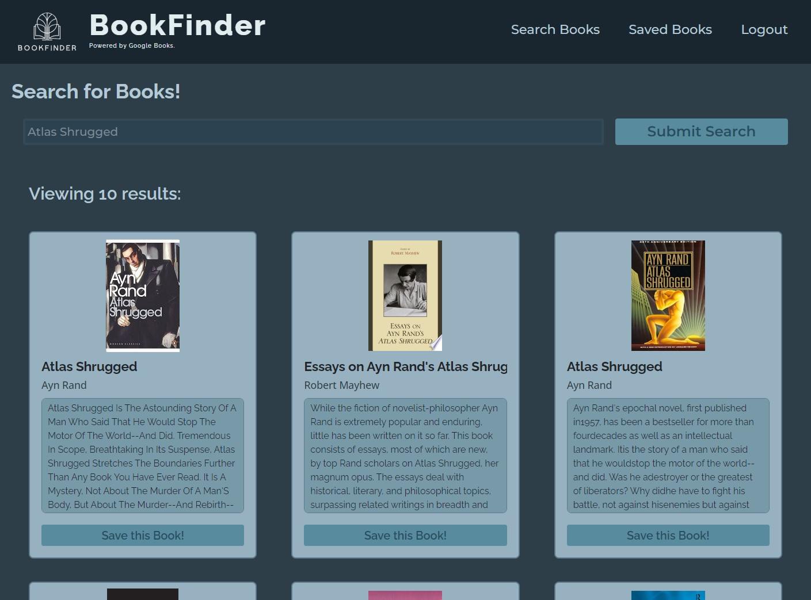
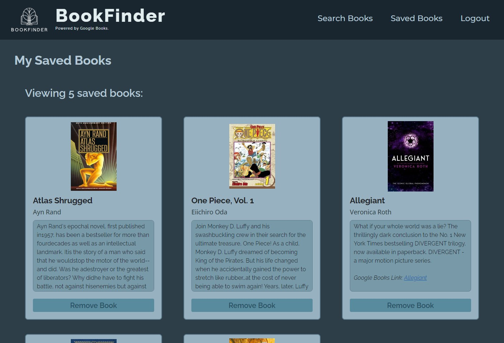

# Book Search Engine
  


## Overview

This application allows users to search for books and save their favorites for later reference. It provides a simple and effective way to explore a vast database of books and keep track of those that interest you.


## Getting Started

To get a local copy up and running, follow these simple steps:

1. Clone the repository to your local machine:
   ```sh
   git clone https://github.com/lifeofmatsu/Book-Search-Engine.git
   cd Book-Search-Engine


## Usage

This section provides guidance on how to use the deployed MERN stack application with GraphQL, focusing on its core features and functionalities.

### Accessing the Application

1. **Open a Web Browser:** Use any modern web browser to navigate to the deployed application's URL provided by Render: [Deployed App](https://book-search-engine-ff7r.onrender.com).

2. **Home Page:** Upon accessing the URL, you will be directed to the home page of the application, where you can explore its features.

### Features and Functionalities

1. **User Registration and Authentication:**
   - If you are a new user, navigate to the `Create Account` (i.e., `Sign Up`) section to register.
   - Fill in the required information, such as username, email, and password, and submit the form to create your account.
   - Existing users can log in by navigating to the `Login` section and entering their credentials.

    

2. **Searching for Books:**
   - Utilize the search bar to look for books by entering keywords, titles, authors, or ISBNs.
   - Press the `Submit Search` button or hit `Enter` to initiate the search.
   - Browse through the search results displayed in a grid format, showing book covers, titles, and brief descriptions.

   

3. **Saving Books:**
   - While logged in, you can save books to your personal collection by clicking the `Save this Book!` button on any book card in the search results.
   - Once saved, the button will change to indicate that the book is saved (e.g., `Book has been saved`).

4. **Viewing Saved Books:**
   - Access your saved books by navigating to the `Saved Books` section or page within the application. Here, you can view all the books you've saved, manage your collection, or remove books from your saved list.

   

## Contributing

We welcome contributions to this project! If you're looking to contribute, here's how you can do so:

1. Fork the Project
2. Create your Feature Branch (`git checkout -b feature/AmazingFeature`)
3. Commit your Changes (`git commit -m 'Add some AmazingFeature'`)
4. Push to the Branch (`git push origin feature/AmazingFeature`)
5. Open a Pull Request

### Reporting Bugs

1. **Open an Issue:** If you find a bug, please check the issues tab to see if it has already been reported. If not, open a new issue and provide a detailed description of the bug, including steps to reproduce, expected behavior, and actual behavior.

2. **Include Screenshots:** If possible, include screenshots to help illustrate the issue. This can be particularly helpful for visual bugs or layout issues.

### Suggesting Enhancements

1. **Submit an Idea:** Have a suggestion for a new feature or an enhancement to an existing feature? Open an issue to propose your idea. Be as detailed as possible, explaining how the feature would work and why it would be beneficial to the project.

2. **Discuss:** Contributors and maintainers may discuss the proposal to understand its implications, refine the idea, and plan its implementation.

### Submitting Changes

1. **Fork the Repository:** Start by forking the repository. This creates your own copy of the project where you can make changes.

2. **Create a Branch:** In your fork, create a new branch for your changes. It's best to name the branch something descriptive, related to the changes you're making.

3. **Make Your Changes:** Work on your changes in your branch. Be sure to adhere to the project's coding standards and document any new code appropriately.

4. **Write Tests:** If your changes add or modify functionality, write tests to cover these changes. Ensure all tests pass to confirm that your changes don't break existing functionality.

5. **Submit a Pull Request:** Once you're satisfied with your changes, submit a pull request to the main repository. Provide a clear description of the changes and reference any related issues.

6. **Review:** Maintainers will review your pull request, possibly request changes or clarification, and eventually decide whether to merge it into the main codebase.


By contributing, you agree to abide by the code of conduct and the community guidelines of this project. We strive to foster an inclusive and welcoming environment for everyone.


## License

[](./LICENSE)

Distributed under the MIT License. See `LICENSE` for more information.


## Contact

**Justin (Jus) Ferrell**

- Email: [jferrell826@gmail.com](jferrell826@gmail.com)
- LinkedIn: [https://www.linkedin.com/in/lifeofmatsu/](https://www.linkedin.com/in/lifeofmatsu/)

- Deployed Page: [https://book-search-engine-ff7r.onrender.com](https://book-search-engine-ff7r.onrender.com)
- Project Link: [https://github.com/lifeofmatsu/Book-Search-Engine.git](https://github.com/lifeofmatsu/Book-Search-Engine.git)


## Acknowledgments

- **API Handling:** [Google Books API](https://www.googleapis.com/books/).
- **Application Fonts:** [Google Fonts](https://fonts.google.com).
- **Debugging Assistance:** [ChatGPT 4](https://chat.openai.com/).
- **Badges:** [Alexandre Sanlim](https://github.com/alexandresanlim/Badges4-README.md-Profile)

### Technologies

    

This application is a dynamic platform that combines the robustness of the MERN stack with GraphQL to offer a seamless user experience. It leverages MongoDB for its database needs, Express.js and Node.js for backend operations, and React with Vite for a fast and modern frontend. The integration of GraphQL with Apollo Client and Server enhances data interaction, allowing users to perform efficient queries and updates. Whether it's managing data, user interactions, or real-time updates, this application provides a comprehensive solution that caters to modern web application needs.
